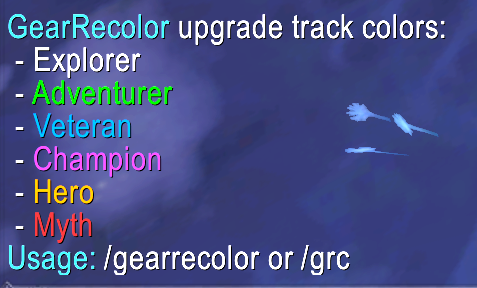

# GearRecolor

`GearRecolor` colors item tooltip upgrade-track lines in WoW Retail:

- Adventurer
- Veteran
- Champion
- Hero
- Myth

## Commands

- `/gearrecolor` - Print the upgrade-track color legend in chat.
- `/grc` - Short alias for the same legend output.

## Screenshot

## Compatibility

- WoW flavor: Retail
- Interface: `120001`
- Language support: Tooltip matching currently uses English upgrade labels.

## Installation

1. Download the latest release zip.
2. Extract the zip into:
   - `World of Warcraft\_retail_\Interface\AddOns\`
3. Ensure the final path is:
   - `World of Warcraft\_retail_\Interface\AddOns\GearRecolor\GearRecolor.toc`
4. Launch WoW and verify the addon is enabled in the AddOns menu.

## Development Notes

- This addon currently targets WoW Retail interface `120001`.
- Tooltip coloring supports both `Upgrade Level` and `Upgrade Track` labels.

## Publishing Targets

To make the addon discoverable in updater clients (such as WowUp), publish releases to one or more addon hosts:

- CurseForge
- Wago Addons
- WoWInterface

See `RELEASE_CHECKLIST.md` for the release pipeline.

## Support

- Bugs/requests: <https://github.com/ohyjek/GearRecolor/issues>
- Please include WoW version, addon version, and a short reproduction step list.

## License

MIT. See `LICENSE`.
